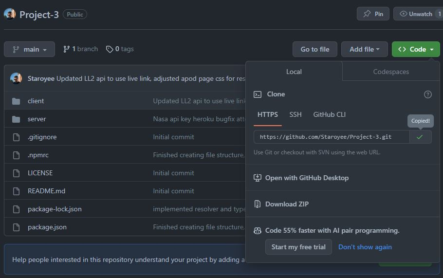

# Project 3: Skyward

## Overview
Skyward is an online space community and information center. Users can sign up, view rocket launches, save launches to favourites, view the NASA Astronomy Picture of the Day, and donate to keep the site up and running.

## Heroku Deployed App
https://skyward-project-57c549ccb969.herokuapp.com/

## User Story

AS a user learning about space, I WANT a website & community where I can explore various different space facts including launches, and space images.
SO THAT I can expant my knowledge in my areas of interest.

## Technologies/Packages/APIs

### Design
📜 [Figma](https://www.figma.com/)

### Frontend

🔥 [React Bootstrap](https://react-bootstrap.netlify.app/)\
🔥 [MaterialUI](https://mui.com/)\
🔥 [Framer Motion](https://www.framer.com/motion/)\
🔥 [React Loader Spinner](https://www.npmjs.com/package/react-loader-spinner)\
🔥 [Stripe](https://stripe.com/en-au)

### Backend

💻 [Apollo Server](https://www.apollographql.com/docs/apollo-server/getting-started/)\
💻 [Axios](https://axios-http.com/docs/intro)\
💻 [Mongoose](https://mongoosejs.com/)\
💻 [MongoDB](https://www.mongodb.com/)\
💻 [Graphql](https://graphql.org/)\
💻 [Express](https://expressjs.com/)

### APIs

🚀 [NASA APIs](https://api.nasa.gov/)\
🚀 [Launch Library 2](https://thespacedevs.com/llapi)

## Future Improvements
Add a notification feature, to tell users when a launch is going to happen. Either through external reminders or on site reminders.
Add Mars weather section

## Installation

Steps to install this project on your local PC

1. Open the termal on your machine.
2. Use the terminal command `cd` to navigate to the directory where you want the repository located.
3. Locate the 'Code' button on the 'Project-3' github repository, click it, then copy the 'HTTPS' link to clipboard. (See image)

4. Use the git command `git clone` followed by the URL copied from Github to clone the repo to your machine.
5. The `git clone` command creates a new directory with the same name as the repository. Navigate into your new directory using `cd`.
6. The repository should now be cloned onto your device and able to be edited in VScode or another editing software.

## License

This project license is under the [MIT](https://opensource.org/licenses/MIT)

## Sources

* https://expressjs.com/
* https://graphql.org/
* https://www.mongodb.com/
* https://mongoosejs.com/
* https://axios-http.com/docs/intro
* https://www.apollographql.com/docs/apollo-server/getting-started/
* https://stripe.com/en-au
* https://www.npmjs.com/package/react-loader-spinner
* https://www.framer.com/motion/
* https://mui.com/
* https://react-bootstrap.netlify.app/
* https://www.figma.com/